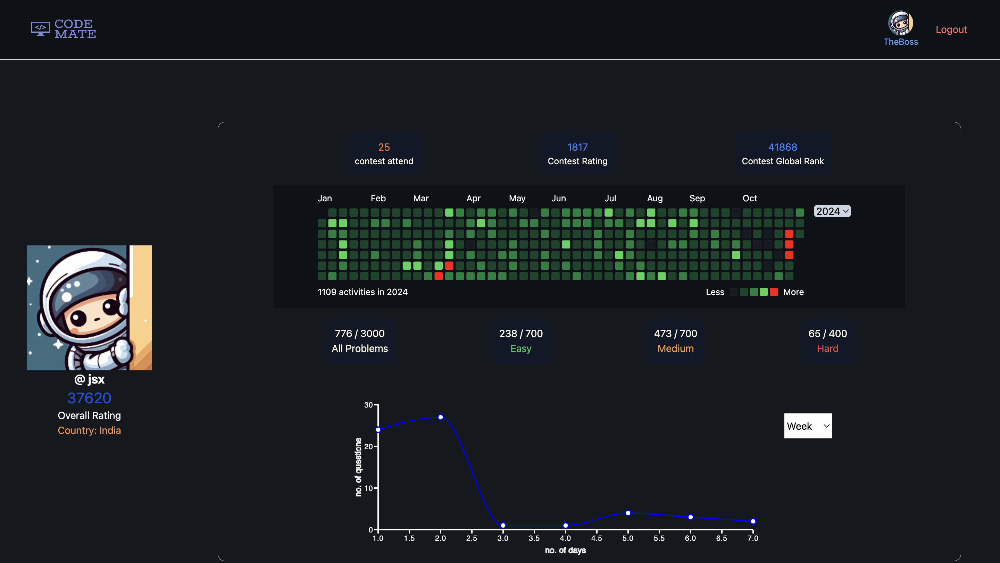

# Code Mate

## Description
Code Mate is a project designed to view LeetCode profiles using usernames. Users can log in and create a room with up to 10 friends to compare performance metrics such as rank, total contests, and more.

## Installation
Follow these steps to install and set up the project:

```bash
# Clone the repository
git clone https://github.com/TheValour/CodeBlock.git

# Navigate to the project directory
cd CodeBlock

# Install dependencies
npm install
```
## Configuration
After cloning the repository and installing the dependencies, you need to configure the application to connect to Firebase and Supabase. Create a `.env` file in the root directory and add the following environment variables:

```plaintext
VITE_API_KEY="your_firebase_api_key"
VITE_AUTH_DOMAIN="your_firebase_auth_domain"
VITE_DATABASE_URL="your_firebase_database_url"
VITE_PROJECT_ID="your_firebase_project_id"
VITE_STORAGE_BUCKET="your_firebase_storage_bucket"
VITE_SENDER_ID="your_firebase_sender_id"
VITE_APP_ID="your_firebase_app_id"

VITE_SUPABASE_URL="your_supabase_url"
VITE_SUPABASE_ANON_KEY="your_supabase_anon_key"
```


## Usage
To run the project, use the following command:

```bash
npm run dev
```


# Sections

> Home page


> View Section



> Room section 


## Tech Stack Used
* TypeScript
* React (for frontend)
* Firebase (for authentication and database)
* Supabase (for storage)
## Resources API

Special thanks to 🙏 [Alfa Arghya](https://github.com/alfaarghya) for providing such a useful API.

You can find the API here: [alfa-leetcode-api](https://github.com/alfaarghya/alfa-leetcode-api)

## Contact
TheValour - [helloworldexe18.email@example.com](mailto:hello.email@example.com)

Project Link: [https://github.com/TheValour/CodeBlock](https://github.com/TheValour/CodeBlock)


| made with ❣️ by TheValour